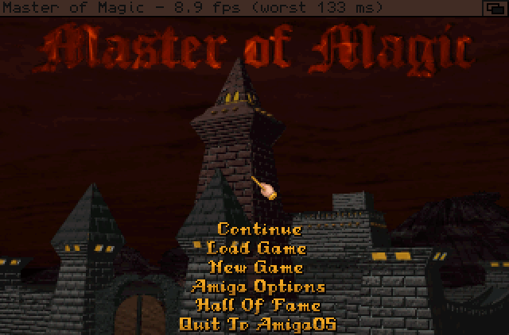
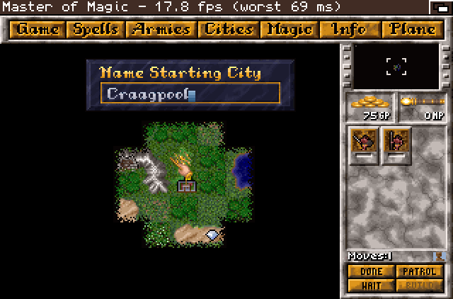
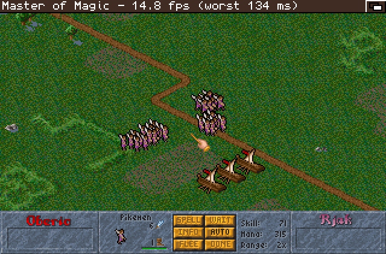
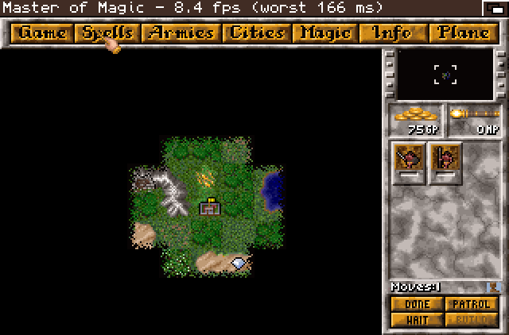
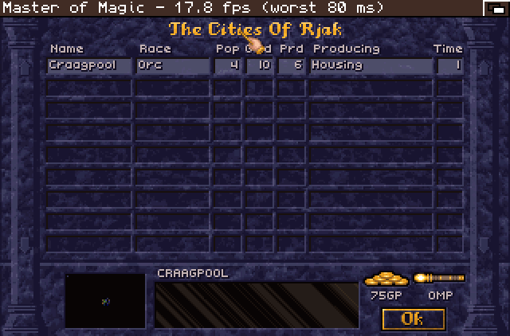
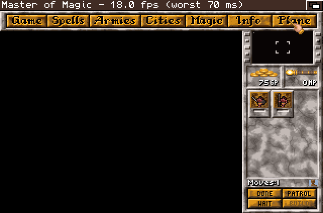

# Master of Magic for Amiga 68k (ReMoM port)

A native AmigaOS 68k port of **Master of Magic** (Simtex, 1994), built from
[jbalcomb/ReMoM](https://github.com/jbalcomb/ReMoM), a reconstruction of
the game's source code in C. It runs on AGA or on an 8-bit RTG screen, with
Workbench still running in the background.

 
 
 

**This repository and its releases contain no game data.** You need your own
copy of Master of Magic. The GOG version works (see below).

## Requirements

- A 68020 or better, no FPU needed. **A 68030 at 50 MHz is recommended.**
- AGA, or an RTG card with an 8-bit screen mode (CyberGraphX or Picasso96)
- Kickstart and Workbench 3.1 or newer
- 8 MB of Fast RAM, plus 2 MB of Chip RAM on AGA
- A hard disk with about 25 MB free for the game data, or about 60 MB with music

## Installing with the GOG version

1. Install *Master of Magic Classic* from GOG on a PC.
2. Open the install folder and find the one that contains `MAGIC.EXE` and the
   `*.LBX` files. It may be the install folder itself or a subfolder of it.
3. Copy these files to one directory on the Amiga, for example `Games:MoM/`:
   - all `*.LBX` files (about 23 MB)
   - `CONFIG.MOM`
   - optionally your `SAVE1.GAM` to `SAVE9.GAM`. Saves are byte-compatible
     with the PC version in both directions.
4. Unpack the release archive into the same directory. It contains `remom`,
   `remom-prefs` and their icons.
5. Start `remom` from its icon. To start it from a Shell, set the stack first
   with `Stack 1000000`.

File names need no conversion, because AmigaOS is case-insensitive. The game
runs without music. For music, see the next section.

### Music (optional)

On the PC the music is General MIDI synthesis, which is too heavy for a 68020.
A converter renders each track from your `*.LBX` files into IMA ADPCM files
(11 kHz, mono) that the Amiga streams from disk. It runs on Linux or WSL:

```sh
sudo apt install gcc python3 libfluidsynth3 timgm6mb-soundfont
sh build/build-host.sh                      # builds the MIDI converter from ReMoM
DANE=/path/to/your/LBX/files sh build/muzyka-host.sh
```

The files are written to `muzyka/` in the `DANE` directory (116 files, about
32 MB). Copy that `muzyka` directory next to `remom` on the Amiga. To use a
different General MIDI soundfont, set `SF=/path/to/file.sf2`.

## Options

`remom-prefs` is a small Workbench program for the settings: graphics (AGA or
RTG), video mode (Auto, PAL or NTSC), screen title bar, FPS on the bar, system
pointer and music. The same options are available in the game's main menu
under **Amiga Options**. Settings are saved to `amiga.cfg`.

## Building from source

This port needs the bebbo amiga-gcc toolchain in `/opt/amiga`, on Linux or WSL.

```sh
# put the CyberGraphX developer headers in native/cgx-include/
# (clib/ cybergraphx/ inline/ libraries/ proto/ - they cannot be redistributed)
DEPLOY=/path/to/amiga/dir sh build/build.sh
```

The build downloads ReMoM at the pinned commit `a9cc082`. It applies
`build/remom-patch.py`, a set of mechanical patches for big-endian byte order,
AmigaOS and speed, and links the result with the Amiga platform layer in
`native/`. The platform layer comes from the author's OpenTTD and OpenXcom
Amiga ports.

Do not strip the binary. `m68k-amigaos-strip` produces an executable that
crashes the machine.

## License

- **ReMoM** belongs to its author, jbalcomb, and currently has no license.
  The author has allowed this port to use the code
  ([permission](docs/author-permission.png)). If you want to use ReMoM's
  code yourself, ask the author at <https://github.com/jbalcomb/ReMoM>.
- **The changes in this repository** (`native/`, `build/`) are licensed under
  the **GNU GPL v3**. ReMoM's author is considering the same license for
  ReMoM, and this choice keeps the port compatible with it.
- *Master of Magic* and all of its data are the property of their rights
  holders. None of the game's data is included here.

## Credits

- jbalcomb, for [ReMoM](https://github.com/jbalcomb/ReMoM)
- Simtex and MicroProse, for Master of Magic
